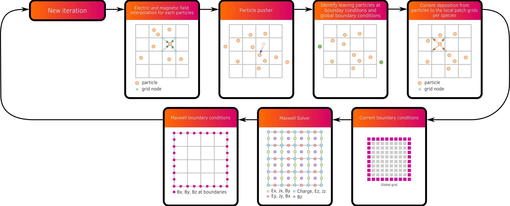
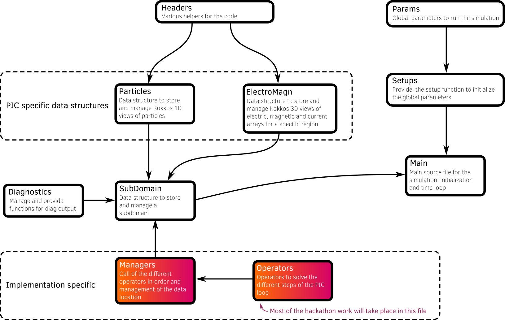

# Developer zone

## Domain decomposition

For the moment, miniPIC does not support distributed memory parallelism.

The domain is decomposed into patches using a 3D cartesian decomposition. Each patch is designed to be independent and can be computed in parallel. It represents a piece of the domain that contains the particles and the local current field grid.

Maxwell's equations are solved at the domain scale.
Therefore, electromagnetic fields grids are global.
A reduction operation is performed to compute the global current grid from the local current grids.

## PIC loop steps

## Code design

The figure below illustrates schematically the code design. It shows how the different classes are organized and how they interact with each other.

Each file provides either a set of functions, a namespace or a data container (class).

| File                   | Where  |Description                                                                                 |
|------------------------|--------|---------------------------------------------------------------------------------------------|
| Headers                | common | Determine the best headers to use depending on the selected backend                         |
| Backend                | common | Data container that contains backend specific parameters (often global) for parallelism     |
| Vector                 | common | Vector class that mimics the std::vector with backend abstraction for both CPU and GPU      |
| Field                  | common | Class that provides 3D arrays with backend abstraction for both CPU and GPU                 |
| Particle               | common | Class that provides a particle container with backend abstraction for both CPU and GPU      |
| ElectroMagn            | common | Class that provide a data container for electromagnetic and current grids                   |
| Patch                  | common | Data container representing a patch entity (see patch decomposition)                        |
| SubDomain              | model specific folders | SubDomain is a data container representing a domain piece                   |
| Diagnostics            | common | Function to perform diagnostic output                                                       |
| Operators              | model specific folders | Functions to perform the Particle-In-Cell loop (such as interpolator, pusher, projection, etc), this header is duplicated for each programming models |
| Timers                 | common | Class that provide timer functionality to monitor the time and make statistics              |
| Main                   | src    | Main source file for the global code structure                                              |

## Macros

| Macros                   | Description                                                            |
|--------------------------|------------------------------------------------------------------------|
| `__MINIPIC_SIMD__`       | Activate specific SIMD pragmas                                         |
| `__MINIPIC_KOKKOS_SCATTERVIEW__` | Activate specific KOKKOS projection types: scatter_view.       |
| `__MINIPIC_KOKKOS_ATOMICVIEW__` | Activate specific KOKKOS projection types: atomic_view.         |
| `__MINIPIC_KOKKOS_NON_UNIFIED__ ` | Macro for code using Kokkos with non unified memory           |
| `__MINIPIC_KOKKOS_UNIFIED__ ` | Macro for code using Kokkos with unified memory                   |
